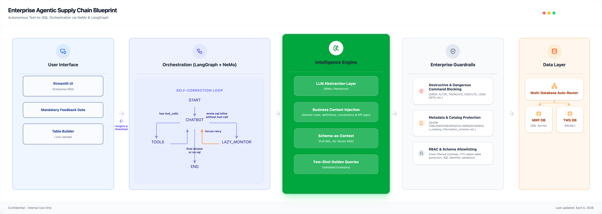
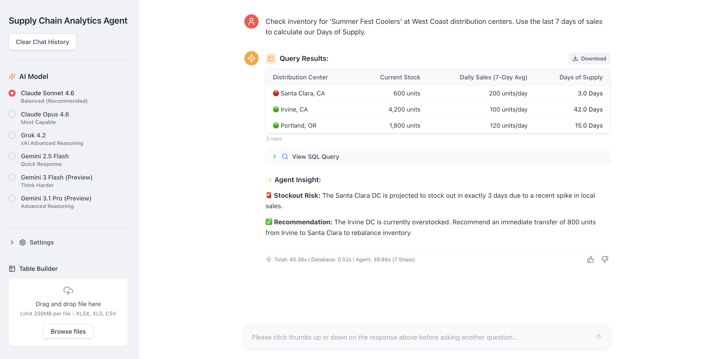

# Enterprise Agentic Supply Chain Blueprint
**Autonomous Text-to-SQL Orchestration via NeMo & LangGraph**

## 📌 Overview
Most Text-to-SQL demos fail in production because they lack enterprise security, domain context, and the ability to autonomously recover from database errors. This repository contains the reference architecture for a production-ready, agentic data analyst designed specifically for Supply Chain operations.

By combining the cyclic state machine orchestration of **LangGraph** with the enterprise acceleration and security of the **NVIDIA NeMo Agent Toolkit**, this blueprint bridges the gap between raw LLM reasoning and strict enterprise data governance.

## 🚀 Core Differentiators

### 1. Autonomous Self-Correction Loop
Unlike linear chains, this agent utilizes a LangGraph state machine with dedicated `chatbot`, `tools`, and `lazy_monitor` nodes. If a generated SQL query hits an execution error (e.g., bad JOIN, syntax error), the error message flows directly back into the state graph. The LLM reasons about the cause and autonomously generates a corrected query on its next iteration.

### 2. The "Table Builder" (File Enrichment Pipeline)
A major differentiator from standard chat interfaces. Users can upload spreadsheets (.xlsx, .csv) directly to the UI. The agent auto-detects join keys, generates a parameterized SQL template, and batches the file through the full enterprise security pipeline, left-merging database insights directly back into the user's spreadsheet.

### 3. Intelligent Multi-Database Routing
Supply chain questions vary from live inventory tracking to historical forecasting. Built-in routing logic evaluates the LLM's target:
* **TMS DB (MySQL):** Handled for Transportation Management System logistics data lookups.
* **MRP DB (SQL Server):** Handled for Material Requirements Planning system material planning data lookups.

### 4. Continuous Learning & "Auto-PR" Loop
Every interaction passes through a mandatory feedback gate. 
* **Positive Feedback:** Automatically harvested, deduplicated by SQL fingerprint, and exported as a "Golden Query" candidate to improve few-shot prompting.
* **Negative Feedback:** Auto-classified into GitHub issues, triggering a closed-loop system where an LLM generates fixes, runs automated regression tests, and creates an Auto-PR for owner review.

## 🧠 The Intelligence Engine (Why DDL over RAG?)
At the core of the system is a multi-provider LLM abstraction layer featuring exponential backoff and cross-provider fallback. The engine relies on:
1. **Schema-as-Context (Full DDL):** We explicitly avoid vector-retrieval (RAG) for schemas. Deterministic loading of exact table structures into the context window guarantees the LLM always sees complete, accurate schemas, eliminating retrieval-quality hallucinations.
2. **Business Context Injection:** Database schemas alone don't explain business logic. We dynamically inject domain knowledge (business rules, specific KPI definitions) directly into the prompt.
3. **Few-Shot Golden Queries:** Validated, human-approved SQL examples injected to steer the LLM toward highly optimized query patterns.

## 🛡️ Enterprise Guardrails (Data Access Control)
Security is enforced at three layers (Context Loading, Prompt Building, and Execution):
* **Strict Table & Column RBAC:** Entire schemas are restricted to authorized user allowlists. Sensitive columns are redacted from schema text for unauthorized users, and queries attempting to access them are hard-blocked at execution.
* **Destructive SQL & Metadata Blocking:** Explicit regex blocks on `DROP`, `ALTER`, `GRANT`, as well as system catalog enumeration (`information_schema`, `v_catalog`).
* **CTE-Aware Allowlisting:** Final generated SQL undergoes CTE-aware table reference extraction to ensure the agent only queries tables explicitly provided in its DDL context.

---
*Note: This repository contains the high-level reference architecture and isolated execution modules for demonstration purposes.*
